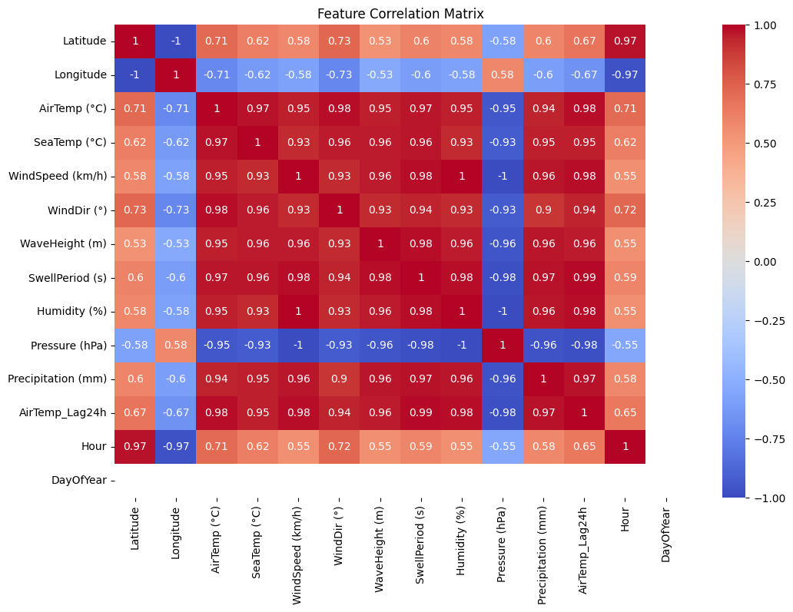

# weather-detection-with-ai-generated-data
This will contain different machine learning models. That are trained in simple ai generated data to predict weather related elements.

As of now this repo has 3 notebooks sections with its indivisual data files .
 
## Phase 1

In this phase, we focus on building and training initial machine learning models using AI-generated and semi-orignal conditational data. The goal is to test the accuracy of the data set by testing it against the realworld data set once completed.

 Update1- 
    After training the weather data we receved a massive error rate in the model 
    Eventhough the model was properly made the data set due to the lack of its relational nature caused the model to be inefficient as shown by the error rate, further testing and the 
     

phase1- Conclusion
    The Ai generated data though looks promissing is as deceving as it looks. Phase 1 marks down the importance of relational data sets in model training. Pluse it also marks the imoprtance of New Features like Web search and Reasoning in Today's LLMs, though this data was not made using these features it shows their importance.

    [for phase 2 we will delve nto more of the relational aspect of ai generated data and its coreletation with the model training] 
